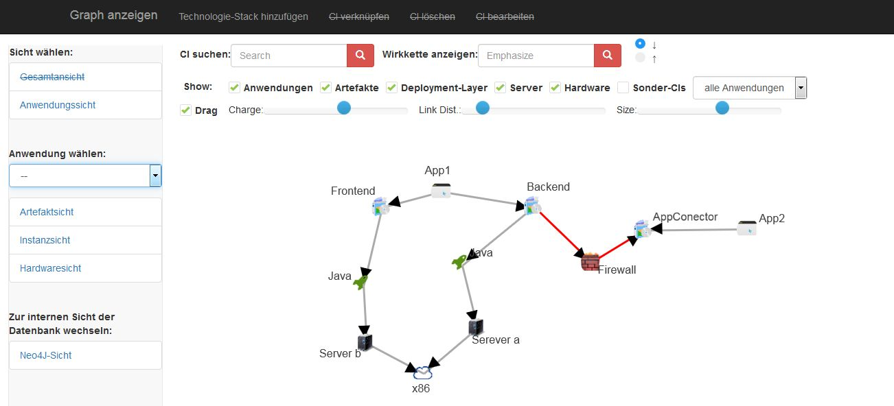
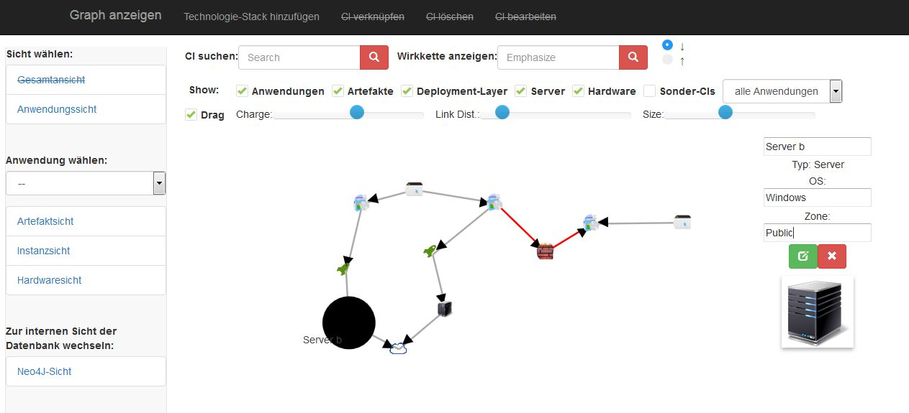
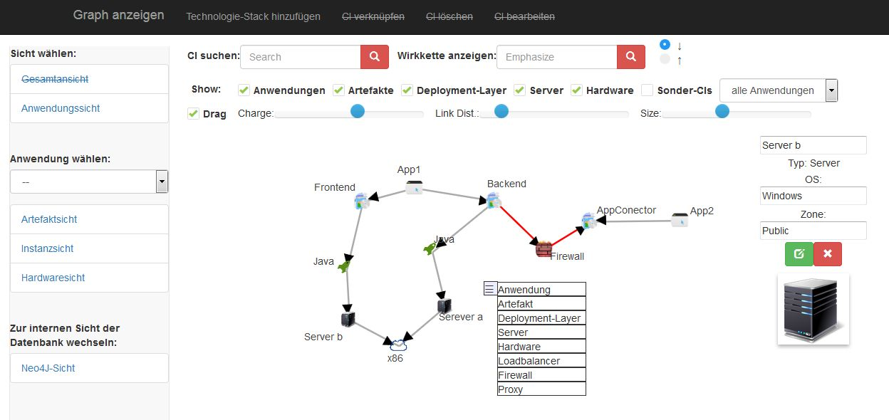

## Screenshots

## Note

This project was just a proof of concept that should replace the lack of current CMDB visualization capabilities. It may contain bugs and old or experimental code. A complete description can be found in my bachelorthesis, which is also public.
Currently the repository contains all the javascriptlibs. I will make a bowerfile or something soon.

## Description

IT-Graphvisualisator can visualize any IT-Infrastructue you can imagine. The following CI-Objects can be used: Application, Artefact, Deployment-Layer, Server, Hardware, Loadbalancer, Proxy and Firewall. They can all be connected by edges. Edges and nodes can have different attributes.

## Prerequisites
* Neo4J
* PHP-Webapache

## Installation

* Install neo4jPHP from here https://github.com/jadell/neo4jphp by using composer and make sure its getting loaded
* Fix your apache configuration by making sure Nei4J can communicate with your PHP-Apache. Depending on the apache you use, you have to enable some modules. I used XAMPP and I added a proxy pass like this in the httpd.conf: 
	ProxyPass /api http://localhost:7474
	ProxyPassReverse /api http://localhost:7474
	ProxyRequests off
* Start Neo4J in a new instance, navigate to your Neo4J-Webbrowser (http://localhost:7474/browser/) and set up the credentials for login. By default its "neo4j" with password "test" in the IT-Graphvisualisator.
* Open the webbrowser and navigate to the index.html file. It should work now.
* Create your own Infrastructurevisualization

## Usage
You can freely create nodes by leftclicking the panel. Edges are generated by doubleclicking a node. Attributes can be set by clicking a node or edge. Then there will be a panel on the right side. You can also delete nodes and edges there. If you want you can also create a complete technology-stack at once. You can also search your CIs and attributes and configure how to visualize them.

## License
  